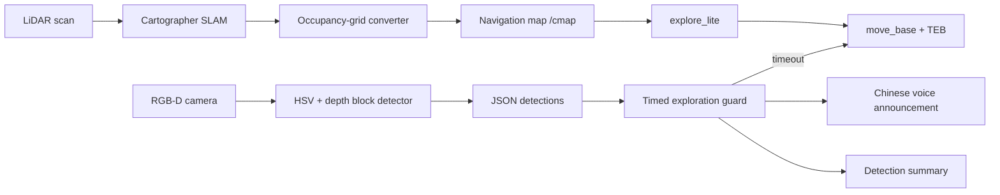

<div align="center">

# Coverage Block Search

**A ROS 1 integration snapshot for autonomous mapping, frontier exploration, RGB-D block detection, and timed return-to-home.**


</div>

## Overview

Coverage Block Search connects a mobile robot's LiDAR, RGB-D camera, Cartographer SLAM, `explore_lite`, `move_base`, and the TEB local planner into one timed exploration workflow. During a run, the robot builds a map, searches frontier regions, detects colored blocks with RGB and depth cues, announces new detections, and returns to a configured home pose when the time limit expires.



## Highlights

- **Autonomous coverage:** frontier selection from `explore_lite` runs against a Cartographer-generated navigation map.
- **RGB-D detection:** HSV color segmentation is filtered by shape, target depth, depth variance, and foreground/background contrast.
- **Duplicate suppression:** detections of the same color near a previous robot pose are treated as the same block.
- **Timed mission control:** exploration stops after a configurable duration, clears costmaps, and retries the return-home goal up to three times.
- **Accessible feedback:** detected colors can be announced in Chinese through `spd-say`.
- **Robot tuning:** Cartographer 2D and TEB parameters are included for a compact differential-drive platform.

## Repository contents

| Path | Purpose |
| --- | --- |
| `cartographer_explore_timed.launch` | Main seven-layer launch flow: drivers, TF, SLAM, navigation, detection, exploration, and mission guard |
| `block_detector.py` | RGB-D colored-block detector and JSON detection publisher |
| `timed_explore_guard.py` | Detection tracking, voice feedback, timeout handling, and return-to-home logic |
| `cartographer_map_converter.py` | Converts Cartographer occupancy values to the ROS `-1 / 0 / 100` convention |
| `my_robot_2d.lua` | Cartographer 2D configuration |
| `teb_local_planner_params.yaml` | TEB tuning for differential-drive navigation |
| `voice_test.py` | Continuous Chinese voice-announcement smoke test |
| `old/` | Earlier exploration and PSO-oriented launch experiments retained for reference |

## Integration requirements

This repository is a **focused snapshot from a larger robot workspace**, not a standalone catkin package. Before launching it, provide the package skeleton and the project-specific resources referenced by the main launch file:

- `package.xml` and `CMakeLists.txt`
- `coverage_common.py`
- `config/default.yaml`
- `arm_camera_reset.py`
- workspace packages named `driver`, `lidar_driver`, `camera_driver`, and `robot_slam_navigation`

The ROS environment also needs the equivalent of:

- ROS 1 with Python 3 and `rospy`
- `cartographer_ros`, `navigation` / `move_base`, `explore_lite`, `teb_local_planner`, and `laser_filters`
- `cv_bridge`, OpenCV, NumPy, `sensor_msgs`, `map_msgs`, `geometry_msgs`, `actionlib`, and `tf`
- `speech-dispatcher` if voice announcements are enabled

Exact package names can vary by ROS distribution and by the surrounding robot workspace.

## Running the mission

After placing these files in a complete `coverage_block_search` package and sourcing the catkin workspace:

```bash
roslaunch coverage_block_search cartographer_explore_timed.launch \
  duration:=180 \
  show_debug_window:=false
```

Useful launch arguments:

| Argument | Default | Meaning |
| --- | ---: | --- |
| `duration` | `180` | Exploration time in seconds before returning home |
| `start_driver` | `true` | Start the robot driver stack |
| `start_lidar` | `true` | Start the LiDAR driver |
| `use_lidar_filter` | `true` | Apply the angular scan filter |
| `start_camera` | `true` | Start the RGB-D camera and arm reset flow |
| `show_debug_window` | `true` | Display annotated OpenCV detections |

The detector publishes JSON on `/coverage_block_search/detection`, for example:

```json
{
  "area": 1284.5,
  "center_x": 312.0,
  "center_y": 224.0,
  "color": "red",
  "depth_m": 0.73,
  "source": "hsv_depth_detector"
}
```

## Validation

The source snapshot can be checked without a running robot:

```bash
python3 -m py_compile *.py
xmllint --noout *.launch old/*.launch
```

Full end-to-end validation requires the companion workspace, sensors, TF tree, and navigation stack listed above.

## License

No open-source license has been declared for this snapshot. Please contact the repository owner before reuse or redistribution.
